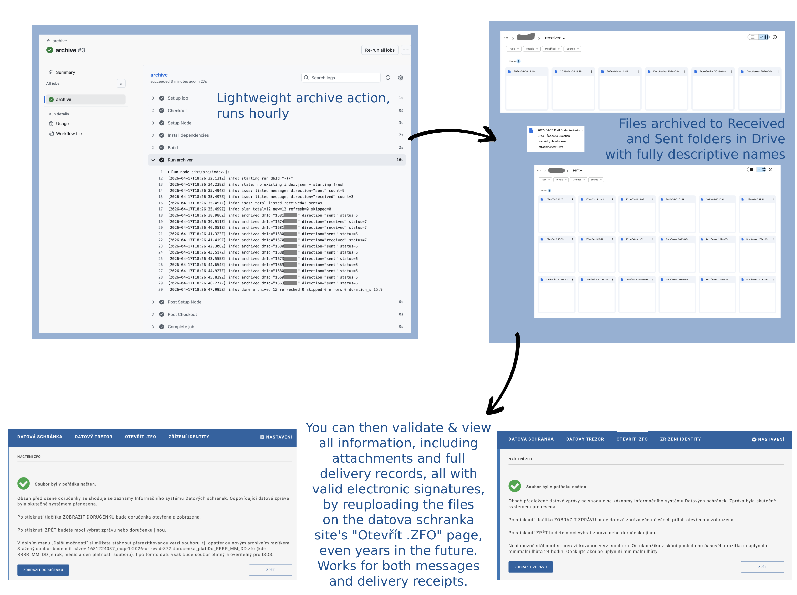

# databox-backup

Personal archiver for the Czech **datová schránka** (ISDS). Every 30 minutes a GitHub Actions workflow pulls new/changed messages from ISDS and stores them (as signed ZFO + signed doručenka) in Google Drive.

Written completely in Typescript, only dependency is fast-xml-parser.


Note: This project is not affiliated with or endorsed by Google or Datové schránky (ISDS). All trademarks and logos are the property of their respective owners.

**No data is retained** outside of the Google Drive folder you configure.

## Why this exists

- **ISDS deletes your messages after 90 days.** Once gone, you lose the ability to prove delivery or reconstruct contents unless you pay for the official *Datový trezor* (120-29 500 CZK / year depending on message volume). This archiver is a free, indefinitely-running alternative that you operate yourself.
- **The free Portál občana archive is not a full substitute.** Its configurable backup omits doručenky and other envelope metadata, so you keep the body of a message but lose the legally-valid proof of when and how it was delivered.
- **ZFO message files are portable and legally actionable.** Any archived ZFO can be loaded back into the datová schránka web UI via the **"otevřít .ZFO"** button at the top of the page (or opened in Datovka desktop) to view the full signed message with all attachments, at any time - even years after ISDS would have deleted it from your schránka. The same ZFO can also be taken to any Czech Point branch for *autorizovaná konverze*: they print it out and stamp it as a legally-valid physical original, useful for court documents carrying a *doložka právní moci* and anywhere a paper original with official equivalence is required.

## What gets archived

Every message and its metadata sent to or received in your databox. The initial sync goes back ~ 90 days (max. ISDS retention period). The message files are stored as official and legally usable ZFO files.

Each ZFO's filename tells you *when*, *who*, *what about*, and *how many attachments* - so you find anything just by scanning a directory listing.

For more details, see [Layout on Drive](#layout-on-drive).



## Costs

To run this yourself you need your own **private** copy of the repo (see the note below the table). On that copy you configure 7 Actions secrets and the scheduled workflow runs there at zero ongoing cost:

| Item | Annual cost |
|---|---|
| ISDS API | 0 CZK |
| GitHub Actions on your private copy of this repo; ~1 440 min/mo (every 30 min × 24 × 30) of the 2 000 free - in practice fewer because GitHub silently skips a non-trivial fraction of scheduled runs, see *Architecture* below. Each run typically finishes in ~30 seconds even when archiving 10+ messages with attachments, and GitHub rounds every run up to a whole billable minute. | 0 CZK |
| Google Drive (15 GB free; usage typically < 1 GB / year) | 0 CZK |
| Google Cloud (OAuth issuance only; no billable APIs) | 0 CZK |
| **Total** | **0 CZK / year** |

GitHub does not allow a direct *Fork* from a public repo into a private one. Use either:

(a) the **Use this template** button on this repo and choose *Private* visibility when creating your copy, or

(b) `git clone` this repo and push the history into a new private repo you create in your own account.

## Architecture

```
GitHub Actions (private)  =>  Node 24 / TypeScript job  =>  ISDS SOAP  (username+password)
    cron: */30 * * * *                                  =>  Google Drive REST v3 (OAuth, drive.file scope)
```

No self-hosted server. No persistent runtime state outside Drive.

Absolutely minimal dependencies, 0 NPM vulnerabilities, unit testing implemented.

## One-time setup

### 1. Authenticate your schránka with a system certificate

The recommended (and long-term) auth path is a **system certificate** (*systémový certifikát*) registered against your schránka. mTLS via the cert replaces username + password for all SOAP calls.

**Get a system cert.** Any qualified Czech CA can issue one - PostSignum (Česká pošta), I.CA, or eIdentita.cz. The output is a public certificate + private key, usually delivered as a PKCS#12 (`.p12` / `.pfx`) bundle with a passphrase.

**Register the public cert with your schránka.** In the DS web UI: *Nastavení → Externí aplikace → Certifikát spisové služby → Přidat certifikát*. Paste the cert in PEM form. From this point on, ISDS will accept that certificate during the TLS handshake when the archiver authenticates.

**Grab your dbID.** It's the schránka's own 7-character identifier (e.g. shown as *ID schránky* on the home screen or under *Nastavení → Informace o schránce*). The archiver uses it to namespace the archive in your Drive folder and to sanity-check that the credential opens the schránka you expected.

Why cert auth:

- **ISDS is enforcing OTP-based 2FA on interactive logins.** That path will eventually stop working for non-interactive use; cert auth is unaffected.
- **Doručenky record EV13 instead of EV11.** Messages pulled by the archiver carry the event "Přihlásila se elektronická aplikace za pomocí systémového certifikátu" — a clean audit trail that distinguishes automated accesses from your personal logins.

This archiver handles one schránka at a time. If you hold multiple schránky, run a second workflow instance with a different repo's secrets and a different cert.

Username + password auth is still supported as a fallback — see the footnote at the end of step 4.

### 2. Create an OAuth client in Google Cloud

1. Go to <https://console.cloud.google.com/>, create a project (any name).
2. *APIs & Services => Library* => enable **Google Drive API**.
3. *APIs & Services => OAuth consent screen* => *External* user type, fill the minimum: app name = `databox-backup`, user support email = yours, dev email = yours. Then click **Publish app** (*Push to production*) and confirm. `drive.file` is a non-sensitive scope so Google publishes immediately without a verification review. **This step is important**: apps left in *Testing* have refresh tokens that expire after 7 days regardless of scope, which silently breaks the scheduled archiver a week after setup. Publishing does not list the app in any marketplace or directory - the only practical effect is disabling the 7-day token timer. (If you would rather stay in *Testing*, add your Google account as a *Test user* and plan to re-bootstrap weekly.)
4. *APIs & Services => Credentials => Create Credentials => OAuth client ID*. Application type = **Desktop app**. Note the client ID and secret.

### 3. Bootstrap the refresh token + Drive folder

Copy the template to `.env.local` (gitignored) and fill in at least the two Google fields:

```
cp .example.env.local .env.local
$EDITOR .env.local
```

Minimum for this step:

```
GOOGLE_OAUTH_CLIENT_ID=...apps.googleusercontent.com
GOOGLE_OAUTH_CLIENT_SECRET=GOCSPX-...
```

Then:

```
npm install
npm run build
npm run bootstrap:google
```

A browser window opens for Google consent. You will see a narrow permission request - the archiver can only touch files it creates itself, never anything else in your Drive:


After you approve, the script prints:

```
GOOGLE_OAUTH_REFRESH_TOKEN=1//0g...
DRIVE_FOLDER_ID=1abcDEF...
```

The Drive folder is created automatically by the script itself (required - the `drive.file` scope only sees files the app creates).

Append both to `.env.local` for local dev.

### 4. Configure GitHub repo secrets

In your private GitHub repo, *Settings → Secrets and variables → Actions → New repository secret*, add the secrets below. The archiver picks the auth path by env-var presence — PEM pair > PFX > username + password — so you only need to populate one auth path's secrets; leave the others unset.

**Schránka identification + Google Drive (always required):**

- `ISDS_DBID`
- `GOOGLE_OAUTH_CLIENT_ID`
- `GOOGLE_OAUTH_CLIENT_SECRET`
- `GOOGLE_OAUTH_REFRESH_TOKEN`
- `DRIVE_FOLDER_ID`

**ISDS auth — preferred path: system cert as PEM pair.** The cleanest path; sidesteps any quirks with PFX encryption (some CA-issued PFX bundles use legacy 3DES that Node 24's bundled OpenSSL 3.x rejects). If your cert came as a `.p12`, extract:

```sh
openssl pkcs12 -in cert.p12 -clcerts -nokeys -out cert.pem
openssl pkcs12 -in cert.p12 -nocerts  -nodes  -out key.pem
```

Then base64-encode each as a single line and paste into the matching GitHub secret:

```sh
# macOS
base64 < cert.pem | tr -d '\n' | pbcopy   # paste into ISDS_CERT_PEM_BASE64
base64 < key.pem  | tr -d '\n' | pbcopy   # paste into ISDS_KEY_PEM_BASE64

# Linux
base64 -w0 cert.pem | xclip -selection clipboard
base64 -w0 key.pem  | xclip -selection clipboard
```

Add both as GitHub secrets:

- `ISDS_CERT_PEM_BASE64`
- `ISDS_KEY_PEM_BASE64`

**ISDS auth — alternative: system cert as PFX bundle.** Skip if you used the PEM path above. Same cert, fed in as the original PKCS#12 file:

```sh
base64 < cert.p12 | tr -d '\n' | pbcopy   # paste into ISDS_CERT_PFX_BASE64
```

Add:

- `ISDS_CERT_PFX_BASE64`
- `ISDS_CERT_PFX_PASSPHRASE`

If your run errors with `mac verify failure`, your PFX is encrypted with legacy 3DES that the bundled OpenSSL won't decrypt. Switch to the PEM pair above.

#### Footnote: username + password (deprecated, plan to migrate)

If you can't (yet) get a system certificate, the archiver also accepts HTTP Basic auth:

- `ISDS_USERNAME` — your DS login (*Uživatelské jméno*, 6-12 lowercase alphanumeric chars; tied to one specific schránka).
- `ISDS_PASSWORD` — your DS password. Set *Nastavení → Přihlášení → Platnost hesla = Trvalá* in the DS web UI or the archiver breaks 90 days after setup when ISDS expires the password.

This path is on its way out. ISDS is enforcing OTP-based 2FA for interactive logins, which will eventually break HTTP Basic against `/DS/dx` and `/DS/dz` for non-interactive use. It's also a worse security posture than a registered system cert: a long-lived password sitting in CI vs. a cert you can revoke centrally and which carries no human-impersonation rights. Migrate when you can.

### 5. First run

From the repo's *Actions* tab, pick the **archive** workflow and hit *Run workflow* (`workflow_dispatch`). The first run backfills everything currently in your schránka (up to the 90-day ISDS retention window).

Verify:

- *Actions* tab shows the run green.
- The Drive folder now contains `received/*.zfo` and `sent/*.zfo`.
- `_state/index.json` exists and has one entry per archived message.
- Open any `.zfo` in Datovka (desktop) - the signature must validate.

After that the `*/30 * * * *` schedule takes over. Check in once a week or so.

## Local development

Requires Node 24.

```
npm install
npm run build        # tsc into dist/
npm test             # node:test, no external framework
npm run lint         # eslint with type-aware rules
npm run verify       # build + lint + test + audit, in one shot
```

`.env.local` is read automatically by `src/config.ts` for local runs - `npm start` after `npm run build` will fire one run against production ISDS and a test Drive folder if you configured one.

## Known risks

- **ISDS 2FA enforcement.** ISDS is enforcing OTP-based 2FA on interactive logins. If you're using the username + password fallback, plan to migrate to system-certificate auth before that path stops working for non-interactive use. The cert path is fully implemented (see step 1 of *One-time setup*).

- **System certificate expiry.** CA-issued system certs typically expire after 1-2 years. The archiver logs cert subject and `daysUntilExpiry` on every run and warns at < 30 days. When yours nears expiry: get a new cert, re-register it under *Nastavení → Externí aplikace → Certifikát spisové služby*, and update the `ISDS_CERT_PEM_BASE64` / `ISDS_KEY_PEM_BASE64` (or PFX) GitHub secrets.

- **Google refresh-token rot.** OAuth apps left in *Testing* publishing status expire refresh tokens after 7 days regardless of scope - this silently breaks the scheduled archiver a week after setup. Fix: *Publish* the OAuth consent screen (step 3 of one-time setup). `drive.file` is non-sensitive so publishing requires no verification and does not list the app anywhere public. After publishing, re-run `npm run bootstrap:google` and replace the `GOOGLE_OAUTH_REFRESH_TOKEN` secret with the new value.

- **ISDS password rotation.** Only relevant on the deprecated username + password path. Set *Platnost hesla: Trvalá* in the DS web UI or the archiver will silently die 90 days after setup.

- **Drive folder deletion by the user.** The app can only see files it created. If you delete the state folder in Drive, the next run will re-archive everything from scratch (duplicates if the originals were not actually deleted).

## Layout on Drive

```
DatovaSchranka/                             <- the folder created by bootstrap
  <ISDS_DBID>/                              <- e.g. xyz1234
    received/
      2026-04-16 14:45 Ministerstvo spravedlnosti - Zadost o pristup k osobnim udajum z evidence prestupku (attachments: 1).zfo
      Doručenka: 2026-04-16 14:45 Ministerstvo spravedlnosti - Zadost o pristup k osobnim udajum z evidence prestupku (attachments: 1).zfo
      ...
    sent/
      2026-04-02 16:39 Ustavni soud - Pl. US 27/09 (attachments: 4).zfo
      Doručenka: 2026-04-02 16:39 Ustavni soud - Pl. US 27/09 (attachments: 4).zfo
      ...
    _state/
      index.json
```

The dbID layer keeps each schránka's archive isolated, so you can point a second deployment (different repo, same Google Drive folder, different `ISDS_DBID`) at the same root without clobbering anything.

## ⚠️ Legal Disclaimer

This project is provided under the terms of the PolyForm Noncommercial License 1.0.0 and is made available “as is”, without warranty of any kind, express or implied, including but not limited to the warranties of merchantability, fitness for a particular purpose, and noninfringement.

By using this software, you acknowledge and agree that:

- You are solely responsible for how you use, configure, and deploy this project.
- This repository may involve handling sensitive data, including but not limited to personal data, official documents (e.g. ZFO files), and message delivery receipts (“doručenky”).
- Misconfiguration, improper use, or lack of understanding may result in data loss, data leaks, unauthorized access, or other security issues.

The author(s) of this project:

- Assume no responsibility or liability for any damages, data loss, legal consequences, or other issues arising from misuse of this project.
- Provide no warranty or support beyond what is explicitly stated.

**Use at your own risk.** Do not use this project unless you:

- Fully understand what it does and how it works
- Are comfortable managing credentials, secrets, and access permissions
- Accept the risks associated with handling potentially sensitive or regulated data
- Understand and agree to comply with all legal regulations, including GDPR

## Troubleshooting

**"no refresh_token returned" from the bootstrap script** - your Google account has previously granted consent to this OAuth client. Revoke it at <https://myaccount.google.com/permissions> and re-run the bootstrap.

**`mac verify failure` on PFX cert auth** - Node 24's bundled OpenSSL 3.x can't decrypt your PFX (likely encrypted with legacy 3DES, common from older CA tooling). Switch to the PEM-pair path: `openssl pkcs12 -in cert.p12 -clcerts -nokeys -out cert.pem` and `openssl pkcs12 -in cert.p12 -nocerts -nodes -out key.pem`, then base64-encode each and set `ISDS_CERT_PEM_BASE64` / `ISDS_KEY_PEM_BASE64` instead.

**ISDS: client certificate rejected by server** - the cert was reachable but ISDS refused it. Most common: the cert hasn't been registered against your schránka, or registration was for a different schránka than `ISDS_DBID`. Re-check *Nastavení → Externí aplikace → Certifikát spisové služby*. Less common: cert expired (run logs `daysUntilExpiry`), or cert was issued by a CA that ISDS doesn't trust.

**ISDS returns dmStatusCode 1212 on login** - username/password invalid (only relevant on the deprecated basic-auth path). Check the DS web UI still accepts the same credentials interactively. If your heslo expired, reset it and then *Nastavení → Přihlášení → Platnost hesla → Trvalá* to prevent recurrence. Or migrate to cert auth.

**ISDS returns 0003 (LIMIT exceeded) from a list call** - should not happen at a personal-user volume, but the client paginates with offset so it will recover on subsequent pages automatically.

**"drive: file not found" after a manual Drive cleanup** - the app references a Drive file ID that no longer exists. Delete the corresponding entry from `_state/index.json` in Drive and the next run will re-archive.
