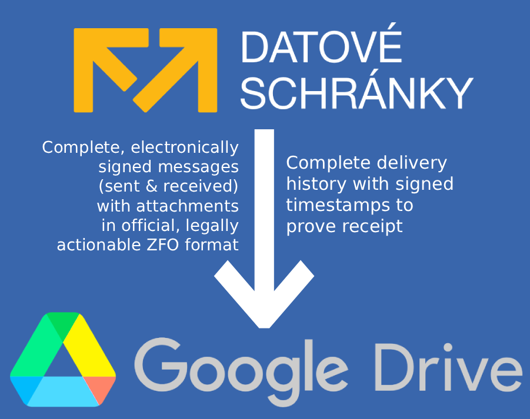
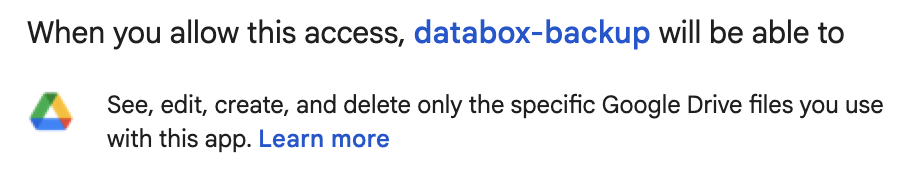

# databox-backup

Personal archiver for the Czech **datová schránka** (ISDS). Every 3 hours a
GitHub Actions workflow pulls new/changed messages from ISDS and stores them
(as signed ZFO + signed doručenka + a manifest sidecar) in Google Drive.



**No data is retained** outside of the Google Drive folder you configure.

## Why this exists

- **ISDS deletes your messages after 90 days.** Once gone, you lose the ability
  to prove delivery or reconstruct contents unless you pay for the official
  *Datový trezor* (120-29 500 CZK / year depending on message volume). This
  archiver is a free, indefinitely-running alternative that you operate
  yourself.
- **The free Portál občana archive is not a full substitute.** Its
  configurable backup omits doručenky and other envelope metadata, so you keep
  the body of a message but lose the legally-valid proof of when and how it
  was delivered.
- **ZFO files are portable and legally actionable.** Any archived ZFO can be
  re-uploaded into the datová schránka UI (or opened in Datovka desktop) to
  view the full signed message with all attachments, at any time - even years
  after ISDS would have deleted it from your schránka. The same ZFO can also
  be taken to any Czech Point branch for *autorizovaná konverze*: they print
  it out and stamp it as a legally-valid physical original, useful for court
  documents carrying a *doložka právní moci* and anywhere a paper original
  with official equivalence is required.

## What gets archived

For every message in your schránka, sent or received, within the last ~95 days:

- `.../direction/YYYY/MM/<dmID>_<slug>.zfo` - the legally-valid signed message
  envelope with all attachments (same file Datovka would export).
- `.../direction/YYYY/MM/<dmID>_<slug>.dorucenka.zfo` - the signed delivery
  receipt. Overwritten in-place on state transitions; SHA-256 is tracked in the
  state index to avoid needless rewrites.
- `.../direction/YYYY/MM/<dmID>_<slug>.manifest.json` - parsed envelope metadata
  (sender, recipient, subject, timestamps, status) for easy searching later.
- `_state/index.json` - the archiver's own state file (which dmIDs are done,
  which are still settling).

## Costs

To run this yourself you need your own **private** copy of the repo (see the
note below the table). On that copy you configure 7 Actions secrets and the
scheduled workflow runs there at zero ongoing cost:

| Item | Annual cost |
|---|---|
| ISDS API | 0 CZK |
| GitHub Actions (your own private copy of this repo with your 7 secrets; ~240-720 min/mo of 2 000 free) | 0 CZK |
| Google Drive (15 GB free; usage typically < 1 GB / year) | 0 CZK |
| Google Cloud (OAuth issuance only; no billable APIs) | 0 CZK |
| **Total** | **0 CZK / year** |

GitHub does not allow a direct *Fork* from a public repo into a private one.
Use either: (a) the **Use this template** button on this repo and choose
*Private* visibility when creating your copy, or (b) `git clone` this repo
and push the history into a new private repo you create in your own account.

## Architecture

```
GitHub Actions (private)  =>  Node 20 / TypeScript job  =>  ISDS SOAP  (username+password)
    cron: 0 */3 * * *                                   =>  Google Drive REST v3 (OAuth, drive.file scope)
```

No self-hosted server. No persistent runtime state outside Drive.

## One-time setup

### 1. Prepare your datová schránka

Log into the DS web UI => *Nastavení => Přihlášení => Platnost hesla*. Set to
**Trvalá**. (Default is 90 days - the archiver would silently break on
rotation.)

While you're there, grab the three values you'll need:

- **Uživatelské jméno** - your login username (6-12 lowercase alphanumeric
  chars, e.g. `abcde1`). This is the value for `ISDS_USERNAME`.
- **Heslo** - password for `ISDS_PASSWORD`.
- **ID schránky** - the schránka's own identifier (7 chars, e.g. `xyz1234`),
  shown on the home screen or in *Nastavení => Informace o schránce*. This is
  the value for `ISDS_DBID`.

Note: the username is tied to a specific schránka. If you hold multiple
schránky (personal + company, for instance), each has its own username. This
archiver handles one schránka at a time - run a second workflow instance with
a different repo's secrets if you need to back up more than one.

### 2. Create an OAuth client in Google Cloud

1. Go to <https://console.cloud.google.com/>, create a project (any name).
2. *APIs & Services => Library* => enable **Google Drive API**.
3. *APIs & Services => OAuth consent screen* => *External* user type, fill the
   minimum: app name = `databox-backup`, user support email = yours, dev email
   = yours. Add your own Google account as a *Test user*. Do **not** publish
   the app - it can stay in "Testing" forever with the `drive.file` scope.
4. *APIs & Services => Credentials => Create Credentials => OAuth client ID*.
   Application type = **Desktop app**. Note the client ID and secret.

### 3. Bootstrap the refresh token + Drive folder

Copy the template to `.env.local` (gitignored) and fill in at least the two
Google fields:

```
cp .example.env.local .env.local
$EDITOR .env.local
```

Minimum for this step:

```
GOOGLE_OAUTH_CLIENT_ID=...apps.googleusercontent.com
GOOGLE_OAUTH_CLIENT_SECRET=GOCSPX-...
```

Then:

```
npm install
npm run build
npm run bootstrap:google
```

A browser window opens for Google consent. You will see a narrow permission
request - the archiver can only touch files it creates itself, never anything
else in your Drive:



After you approve, the script prints:

```
GOOGLE_OAUTH_REFRESH_TOKEN=1//0g...
DRIVE_FOLDER_ID=1abcDEF...
```

The Drive folder is created automatically by the script itself (required - the
`drive.file` scope only sees files the app creates).

Append both to `.env.local` for local dev.

### 4. Configure GitHub repo secrets

In your private GitHub repo, *Settings => Secrets and variables => Actions =>
New repository secret*, add seven secrets with exactly these names:

- `ISDS_USERNAME`
- `ISDS_PASSWORD`
- `ISDS_DBID`
- `GOOGLE_OAUTH_CLIENT_ID`
- `GOOGLE_OAUTH_CLIENT_SECRET`
- `GOOGLE_OAUTH_REFRESH_TOKEN`
- `DRIVE_FOLDER_ID`

### 5. First run

From the repo's *Actions* tab, pick the **archive** workflow and hit *Run
workflow* (`workflow_dispatch`). The first run backfills everything currently
in your schránka (up to the 90-day ISDS retention window).

Verify:

- *Actions* tab shows the run green.
- The Drive folder now contains `received/YYYY/MM/*.zfo`, etc.
- `_state/index.json` exists and has one entry per archived message.
- Open any `.zfo` in Datovka (desktop) - the signature must validate.

After that the `0 */3 * * *` schedule takes over. Check in once a week or so.

## Local development

Requires Node 24.

```
npm install
npm run build        # tsc into dist/
npm test             # node:test, no external framework
npm run lint         # eslint with type-aware rules
npm run verify       # build + lint + test + audit, in one shot
```

`.env.local` is read automatically by `src/config.ts` for local runs -
`npm start` after `npm run build` will fire one run against production ISDS
and a test Drive folder if you configured one.

## Known risks

- **ISDS 2FA enforcement.** The Digitální a informační agentura has been
  pushing OTP-based 2FA for interactive DS access. If it becomes mandatory for
  non-interactive / API auth too, `Authorization: Basic ...` against `/DS/dx`
  and `/DS/dz` will start returning an auth failure on every run and GitHub
  Actions will email you about the red runs.

  **Workaround: switch to commercial client-certificate (mTLS) auth.** Outline
  of the change:

  1. Obtain a commercial SSL certificate. PostSignum or I.CA "Standard" work;
     cost is roughly 300-1500 CZK/year. Qualified certs from eIdentita.cz also
     work. Generate the CSR locally so you control the private key.
  2. In the DS web UI, *Nastavení => Přístup => Certifikáty* (menu path may
     vary), upload the public certificate and bind it to your user.
  3. Change `ISDS_ENDPOINTS` in `src/config.ts` to the mTLS variants:
     `https://ws1.mojedatovaschranka.cz/cert/DS/dx` and
     `https://ws1.mojedatovaschranka.cz/cert/DS/dz`.
  4. In `src/isds.ts`, drop the `Authorization: Basic ...` header and route
     the fetch through an HTTPS client that presents the client cert. Node 20's
     `fetch` does not accept an `agent` directly; two working approaches:
     (a) use `undici.Agent` with `connect: { cert, key }` and pass it as
     `dispatcher`; or (b) rewrite `call()` to use `node:https.request` with
     `cert` and `key` options. The SOAP envelope building, response parsing,
     and the rest of the pipeline are unchanged.
  5. Store the PEM-encoded cert and key in two new GitHub Actions secrets
     (`ISDS_CLIENT_CERT`, `ISDS_CLIENT_KEY`) and load them via
     `loadIsdsConfig()`.

  `ISDS_USERNAME` and `ISDS_DBID` stay populated even on mTLS - the cert still
  needs to resolve to a specific user on a specific schránka.

- **Google refresh-token rot.** With the `drive.file` scope (non-sensitive),
  refresh tokens issued to a "Testing" OAuth app should not expire on the
  typical 7-day timer that applies to sensitive scopes. If a token is revoked
  anyway, re-run `npm run bootstrap:google` and replace the
  `GOOGLE_OAUTH_REFRESH_TOKEN` secret.

- **ISDS password rotation.** Set *Platnost hesla: Trvalá* or the archiver
  will silently die 90 days after setup.

- **Drive folder deletion by the user.** The app can only see files it
  created. If you delete the state folder in Drive, the next run will
  re-archive everything from scratch (duplicates if the originals were not
  actually deleted).

## Layout on Drive

```
DatovaSchranka/                             <- the folder created by bootstrap
  <ISDS_DBID>/                              <- e.g. xyz1234
    received/
      2026/04/
        1234567890_rozhodnuti-c-42-2026.zfo
        1234567890_rozhodnuti-c-42-2026.dorucenka.zfo
        1234567890_rozhodnuti-c-42-2026.manifest.json
        ...
    sent/
      2026/04/
        ...
    _state/
      index.json
```

The dbID layer keeps each schránka's archive isolated, so you can point a
second deployment (different repo, same Google Drive folder, different
`ISDS_DBID`) at the same root without clobbering anything.

## Troubleshooting

**"no refresh_token returned" from the bootstrap script** - your Google
account has previously granted consent to this OAuth client. Revoke it at
<https://myaccount.google.com/permissions> and re-run the bootstrap.

**ISDS returns dmStatusCode 1212 on login** - username/password invalid.
Check the DS web UI still accepts the same credentials interactively. If your
heslo expired, reset it and then *Nastavení => Přihlášení => Platnost hesla =>
Trvalá* to prevent recurrence.

**ISDS returns 0003 (LIMIT exceeded) from a list call** - should not happen
at a personal-user volume, but the client paginates with offset so it will
recover on subsequent pages automatically.

**"drive: file not found" after a manual Drive cleanup** - the app references
a Drive file ID that no longer exists. Delete the corresponding entry from
`_state/index.json` in Drive and the next run will re-archive.
